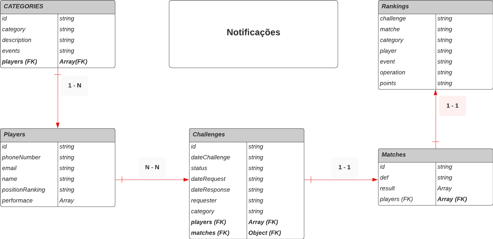

# Player Tenis API

## 👉 Diagrama da Entidade-Relacionamento



## 1 - Link da documentação - SWAGGER

[http://localhost:8080/api/v1/docs/](http://localhost:8080/api/v1/docs/)

## 2 - Sobre a Aplicação

Uma aplicação backend ultilizada para listagem de partidas dos jogadores de tênis.
Os jogadores fazem parte de um ranking que é atualizado conforme a realização das partidas.

## 3 - Como rodar localmente

### 3.1 - Instalações necessárias [Node.js](https://nodejs.org/en/download/) && [NPM](https://docs.npmjs.com/cli/v8/commands/npm) && [CLI Nest.js](https://docs.nestjs.com/)

### 3.2 - faça o fork deste repositório em sua conta do github <br />

- Dentro deste repositório [https://github.com/andreyna1808/playerTenisAPI](https://github.com/andreyna1808/playerTenisAPI), o botão de Fork fica no canto superior direito da tela, aproveita para dar uma estrelinha. 🙈
- Agora, abra o terminal e rode os comandos abaixo.

### 3.3 - Faça o clone do repositórioa via HTTPS ou SSH

HTTPS:

```bash
git clone https://github.com/andreyna1808/playerTenisAPI.git
```

SSH:

```bash
git clone git@github.com:andreyna1808/playerTenisAPI.git
```

> OBS: Ao fazer o Fork você tem a opção de alterar o nome do repositório, substitua pelo nome escolhido na hora do Fork.

### 3.4 - Entre no terminal para acessar o diretório

```bash
cd playerTenisAPI && cd player-tenis-api
```

### 3.5 - Instale as dependências

```bash
npm i
```

### 3.6 - Inicie o servidor backend

```bash
npm run start:dev
```

## 4 - Mapeamento de requisitos

### JOGADOR

- Solicitar ou rejeitar um desafio
- Registrar o resultado de uma partida
- Acompanhar os rankings
- Consultar seus dados e seu histórico de partidas (vitórias, derrotas, posição no ranking)
- consultar as informações de seus adversários(histórico de partidas e dados)
- ser notificado por E-Mail quando for desafiado

### ADMNINISTRADOR

- Cadastrar as categorias e definir as pontuações
- Cadastrar jogadores e definir suas categorias
- Ser notificado quando existir um desafio pendente a mais de 10 dias

## 👉 Tecnologias utilizadas

[](https://skillicons.dev)

👉 Para todos verem

- Na imagem acima estão os ícones das tecnologias utilizadas sendo: javascript, typescript, nodejs, nest, mongodb, git, linux e vscode.

## 👉 Contatos da desenvolvedora

<div> 
  <a target="_blank" href="https://www.youtube.com/channel/UCBIL9fcbrliSq_cGxqHr6sA"></a>
  <a target="_blank" href="https://www.instagram.com/devdrica/"></a>
  <a target="_blank" href="mailto: andreyna.m.carvalho@gmail.com"></a>
  <a target="_blank" href="https://www.linkedin.com/in/andreyna-carvalho-997273231/"></a> 
  <a target="_blank" href="https://wa.me/5548991052198"></a> 
</div>

----

## 👉 made with

[<br><sub>Andreyna Carvalho</sub>](https://github.com/andreyna1808)
